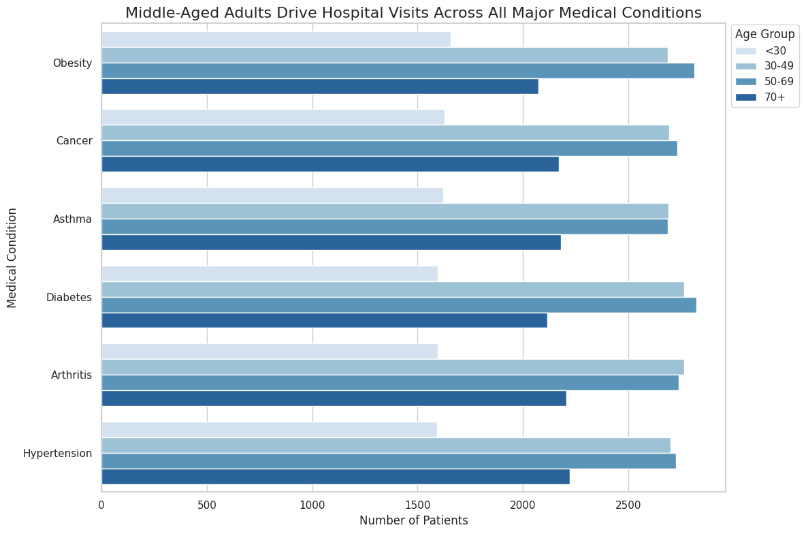
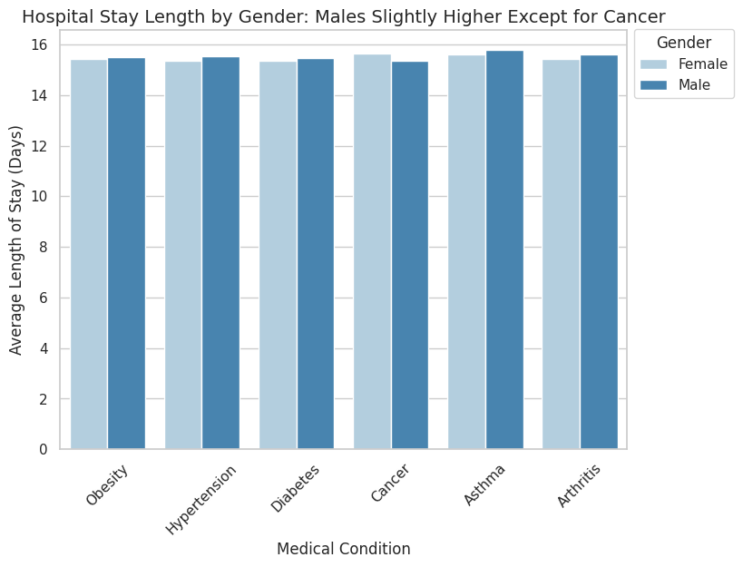
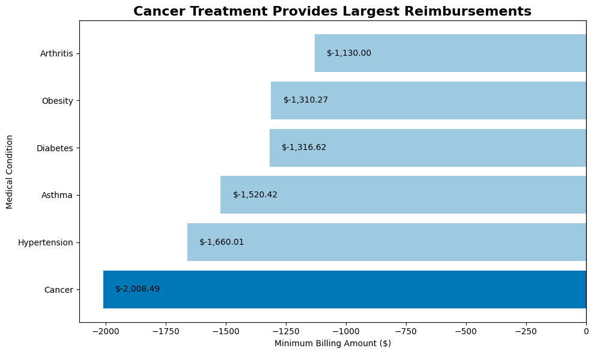
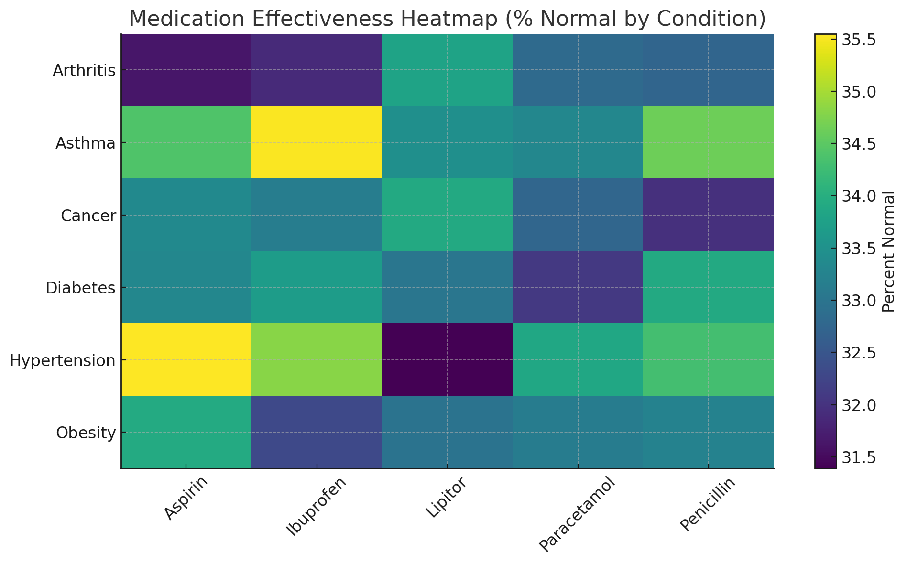

# Healthcare Project

## Table of Contents
1. [Project Overview](#project-overview)
2. [Business Questions](#business-questions)
3. [Analysis Approach](#analysis-approach)
4. [Key Findings & Insights](#key-findings--insights)
5. [Strategic Recommendations](#strategic-recommendations)
6. [Next Steps](#next-steps)
7. [Technical Details](#technical-details)
8. [Author & Contact](#author--contact)

---

## Project Overview

**Description:**  
This project analyzes a transactional dataset containing hospital and medical transactions between **01/12/2010 and 09/12/2011**. The dataset provides insights into **admissions, reimbursements, and medication effectiveness** across several medical conditions.  

[Dataset Link](https://www.kaggle.com/datasets/prasad22/healthcare-dataset)

**Objective:**  
The goal is to identify patterns in **patient admissions, cost distribution, and treatment effectiveness**, highlighting anomalies or opportunities for **optimization and strategic decision-making**.

**Dataset includes:**  
- Patient demographics and admission data  
- Medical conditions and hospital visits  
- Billing and reimbursement data  
- Medication records and treatment outcomes  

---

## Business Questions

1. **Outcomes and Admissions**  
   - How many patients are admitted per medical condition?  
   - Are there differences in outcomes based on admission type or gender?  

2. **Cost Analysis – Resource Utilization**  
   - Which medical conditions result in the largest reimbursements?  
   - Are there anomalies in minimum or maximum billing amounts?  

3. **Patterns with Medications and Medical Conditions**  
   - Which medications are most effective for specific medical conditions?  
   - Are there patterns in prescriptions across patient demographics?  

---

## Analysis Approach

### 1. Outcomes and Admissions

**SQL Query:**   

**Visualization:**  
  
*Horizontal bar graph showing the number of patients visiting the hospital by major medical condition.*

  
*Vertical bar graph comparing the length of stay across medical conditions and genders.*

**Key Insights:**  
- Patient admissions are fairly consistent across major medical conditions.  
- Gender differences in length of stay are minimal, suggesting similar care patterns.  

---

### 2. Cost Analysis – Resource Utilization

**SQL Query:**   

**Visualization:**  
  
*Diverging bar graph showing minimum billing amounts for each medical condition. Highlights potential outlier reimbursements, underpayments, or adjustment anomalies.*  

**Key Insights:**  
- **Cancer treatments show the highest minimum reimbursements**, making it a standout condition for cost management focus.  
- Other conditions have similar average billing amounts, but **negative minimum values indicate refunds, corrections, or adjustments** that may need review.  
- These patterns suggest **opportunities to optimize billing and reimbursement processes**, and to flag unusual transactions for auditing.  

---

### 3. Patterns with Medications and Medical Conditions

**SQL Query:**   

**Visualization:**  
  
*Heatmap showing the most effective medications for each medical condition.*  

**Key Insights:**  
- Certain medications show **higher effectiveness for specific conditions**, which could guide treatment protocols.  
- Patterns across conditions may highlight opportunities to **improve patient outcomes while controlling costs**.  

---

## Key Findings & Insights
- Cancer treatments have consistently **higher minimum reimbursements** compared to other conditions.  
- Negative minimum billing amounts indicate **adjustments or underpayments** that require review.  
- Patient admissions are relatively uniform across conditions, with minimal gender-based differences in length of stay.  
- Medication effectiveness patterns suggest opportunities to **align prescriptions with condition-specific efficacy**, improving outcomes and cost efficiency.  

---

## Strategic Recommendations
- Focus billing reviews on **high-reimbursement conditions**, particularly Cancer, to ensure accuracy.  
- Investigate transactions with **negative minimum billing amounts** to prevent potential losses.  
- Use medication effectiveness insights to **guide treatment protocols**, ensuring optimal outcomes while managing costs.  
- Monitor patterns over time to **identify systemic adjustments or anomalies** that could impact reimbursement or care quality.  

---

## Next Steps
- Incorporate additional patient demographic data to refine analysis.  
- Expand analysis to multi-year trends for cost, admissions, and medication effectiveness.  
- Develop predictive models to **forecast reimbursements and optimize resource allocation**.  

---

## Technical Details
- **Tools Used:** SQL (DBeaver), Python (Pandas, Matplotlib, Seaborn), Tableau (optional for dashboards)  
- **Data Cleaning:** Handling missing values, negative billing amounts, and duplicate entries.  
- **Visualizations:** Horizontal and vertical bar charts, diverging bar charts, heatmaps.  

---

## Author & Contact
**Dmitry Kuvyrdin**  

✉️ Email: [dmitry.kuvy@gmail.com](mailto:dmitry.kuvy@gmail.com)  
📞 Phone: (650) 861-2643  
🔗 LinkedIn: [linkedin.com/in/dmitry-kuvyrdin](https://linkedin.com/in/dmitry-kuvyrdin)  
🐙 GitHub: [github.com/dmitryk5](https://github.com/dmitryk5)

